# Hands-On Git Project: Collaborative Website Development with Git and GitHub

In this mini-project, we'll create a step-by-step project to stimulate the workflow of Tom and Jerry using Git and GitHub. This hands-on project will include 
installation of Git, setting up a GitHub repository, cloning the repository, creating branches, making changes, and merging those changes back into the main branch.

## Part 1: Setup and Initial Configuration

### Install Git:

- Visit the official Git Website (https://git-scm.com/downloads) and download the latest version of Git suitable for your operating system.

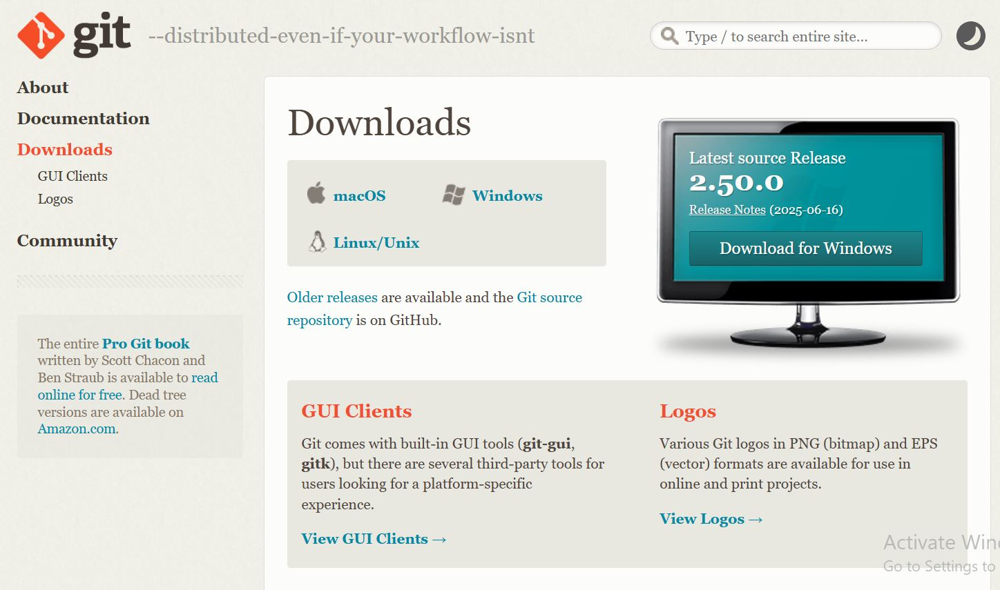

- Follow the instructions to install git.

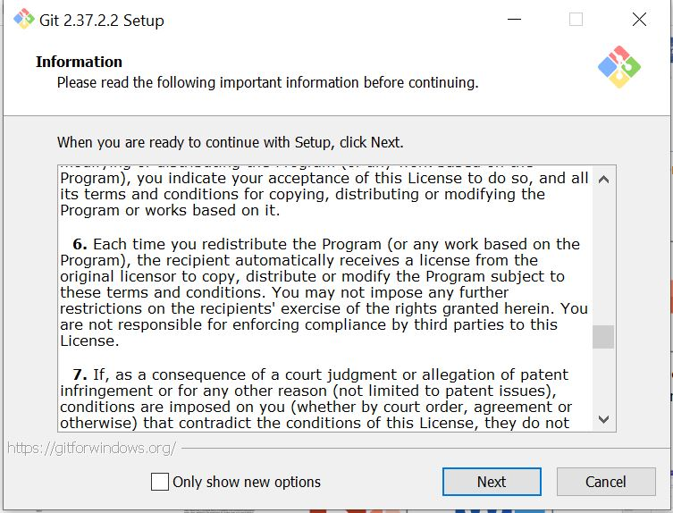

### Create a GitHub Repository:

- Sign up or login to GitHub.

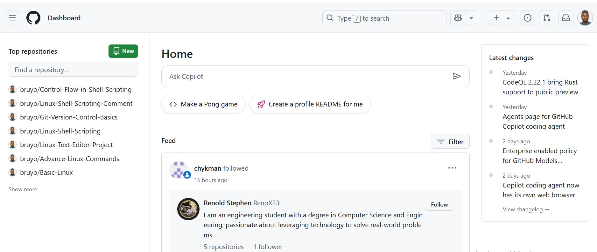

- Click the "+" icon in the top-right corner and select "New Repository"

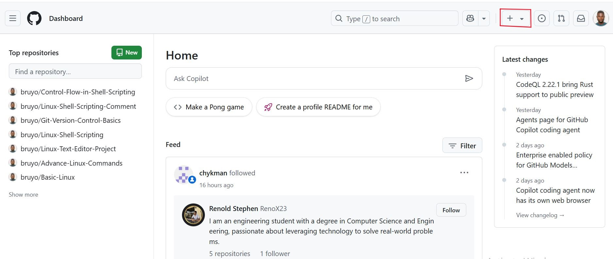

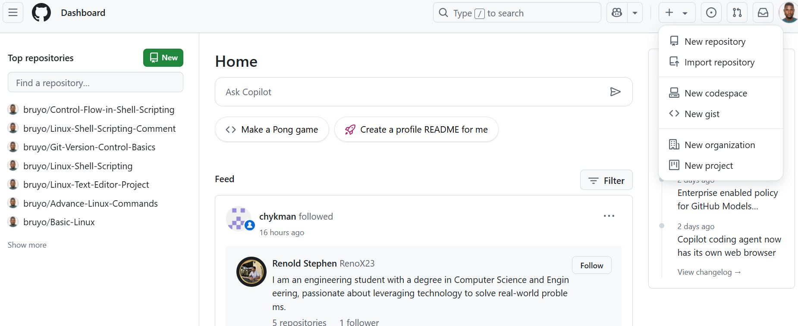

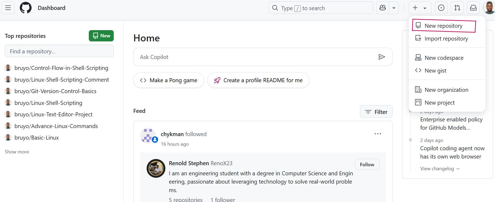

- Name your repository "ai-startup-website" and initialize it with a README file.

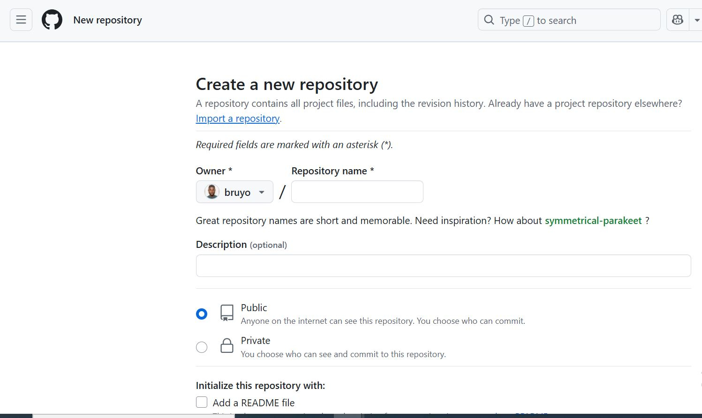

- Click "Create Repository" 

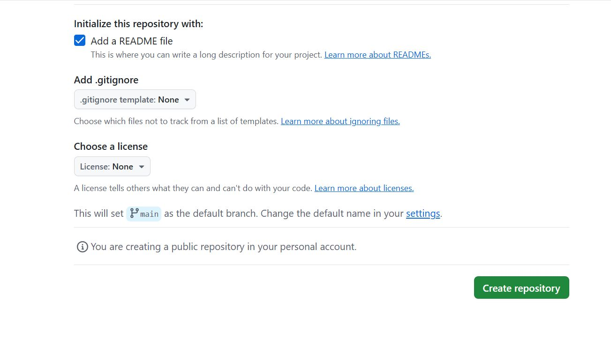

### Clone the Repository

- On your repository's page on GitHub, click the "Code" button and copy the HTTPS URL.

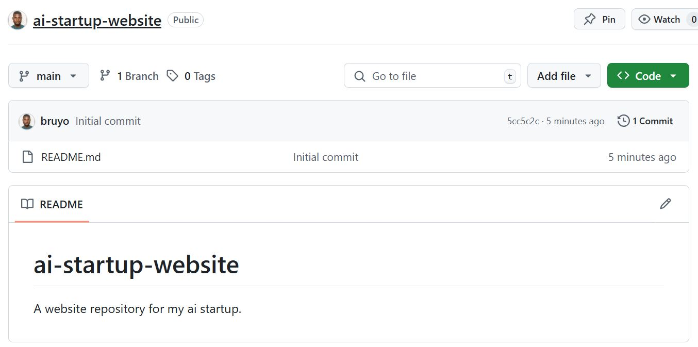

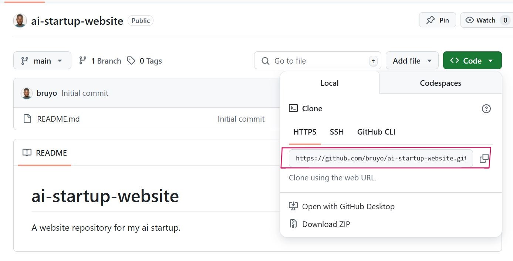

- Open your terminal or command prompt.

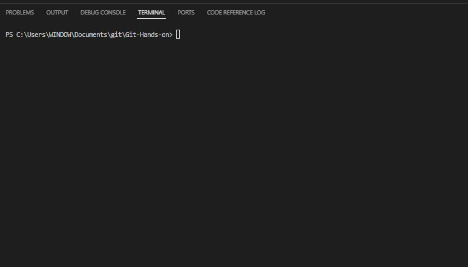

- Create a folder named "git-project"

'mkdir git-project

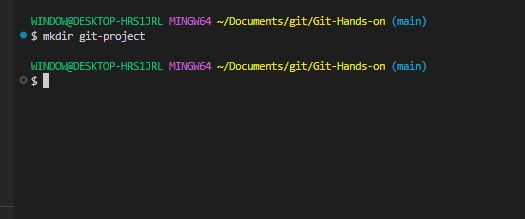

- Change directory into "git-project".

'cd git-project'

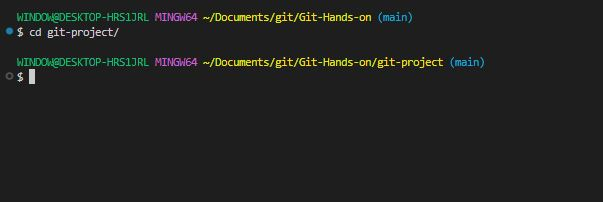

- Clone (Download) the repository from GitHub using

'git clone https://github.com/bruyo/ai-startup-website.git'

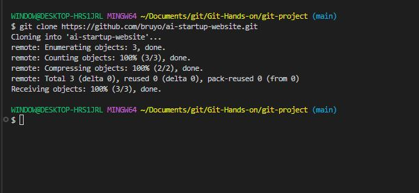

- Since you have just clonned your repository, your branch is "main"

- Navigate into the repository you clonned.

'cd ai-startup-website'

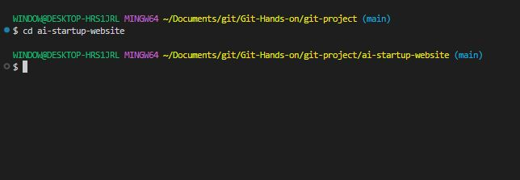

- Create an empty file "index.html"

'touch index.html'

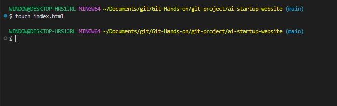

- Add the content below 

" This is the Admin creating an index.html file for Tom and Jerry."

'vim index.html'

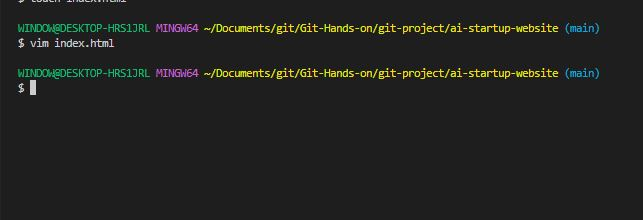

- Check changes has not been staged.

'git status'

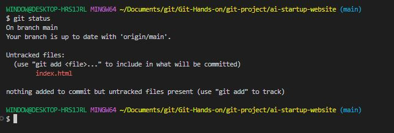

- Stage changes.

'git add index.html'

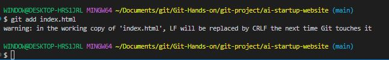

- Confirm changes have been staged for commit.

'git status'

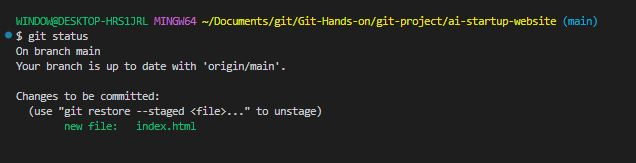

- Commit changes

'git commit -m "This is my first commit"'

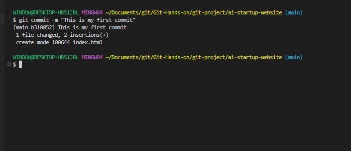

- Push main branch to GitHub

'git push origin main'

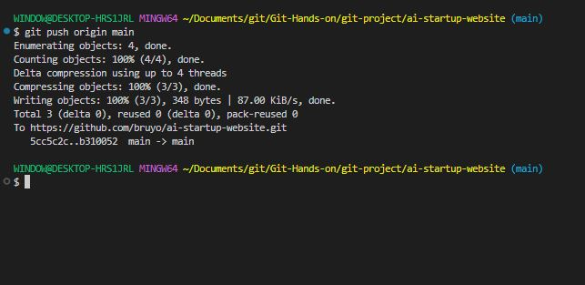

## Part 2: Simmulating Tom and Jerry's Work

To simulate both Tom and Jerry working on the same laptop, you'll switch between two branches, making changes as each character.

### Tom Work:

- Navigate to the project dirctory you just cloned:

'cd ai-startup-website'

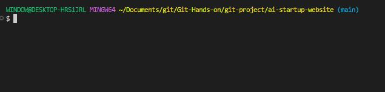

- Check the current branch.

'git branch'

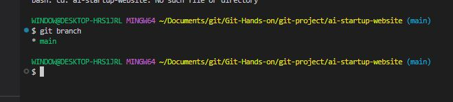

- Create a new branch for Tom's work.

'git checkout -b update-navigation'

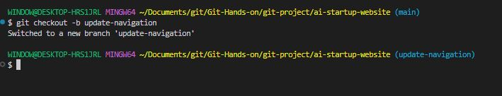

- Check the branch again to see your newly created branch.

'git branch'

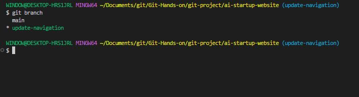

- Recall you created an empty file "index.html" in the main branch. The file also exist in the "*update-navigation-branch*": Open the 'index.html' and add the content below.

'vim index.html'

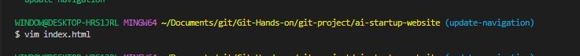

'This is Tom adding Navigation to the AI-website'

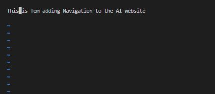

- Check changes has not been staged.

'git status'

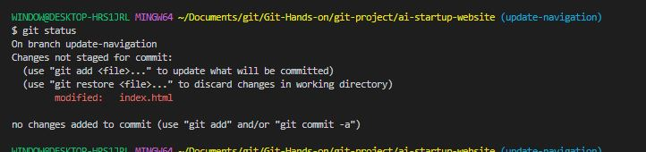

At this stage, Tom has modified the file, but these changes haven't been prepared for a commit in Git. This is indicated by the file name appearing in *red* in the terminal output, signaling that the changes 
are not recognized by Git but not yet staged.

- Stage Tom changes.

'git add index.html'

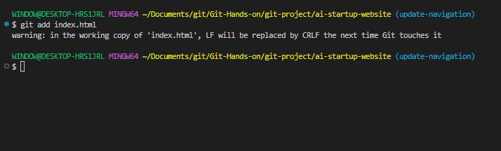

- Confirm changes have been staged for commit.

'git status'

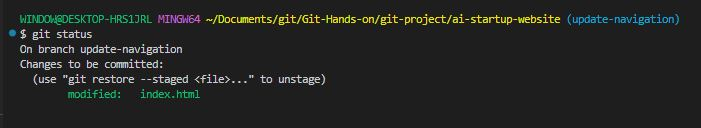

Now, after staging the changes, the file name will appear in *green* in the terminal output. This color signifies that the file has been successfully staged, making it
ready for the next step, which is committing these changes to the project history.

- Commit Tom changes

'git commit -m "Update navigation bar"'

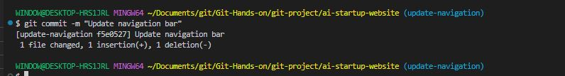

- Push Tom's branch to GitHub.

'git push origin update-navigation'

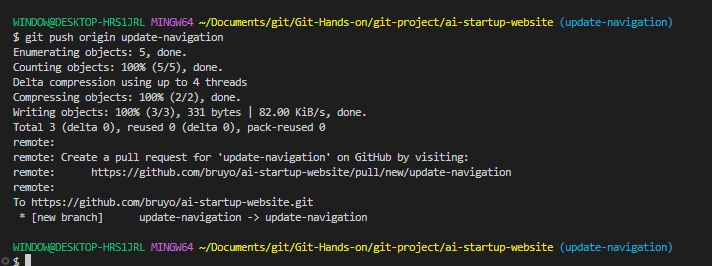

After completing Tom's workflow, you will now simulate Jerry's contribution tho the project. To do this, you'll take the following steps;

- Switch back to main branch 

'git switch main'

'git checkout main'

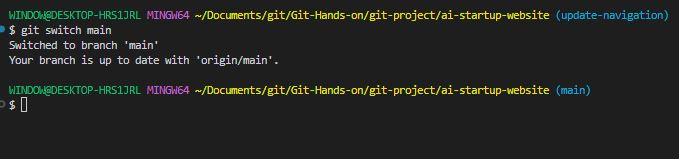

- Pull the latest changes.

'git pull origin update-navigation'

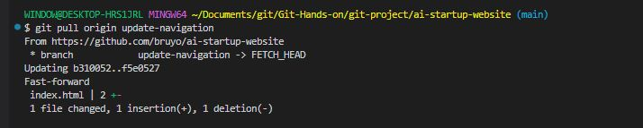

- Create a new branch for Jerry' Work.

'git checkout -b add-contact-info'

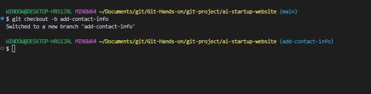

- Open *index.html* and Add Contact Information: Make your changes to the *index.html* file by adding contact information. 

'vim index.html'

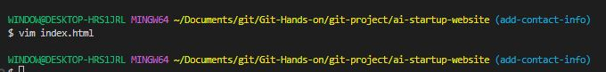

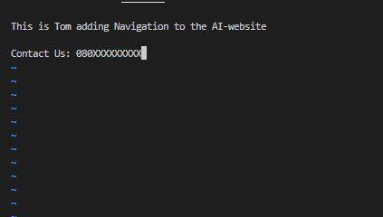

- Stage Jerry changes.

'git add index.html'

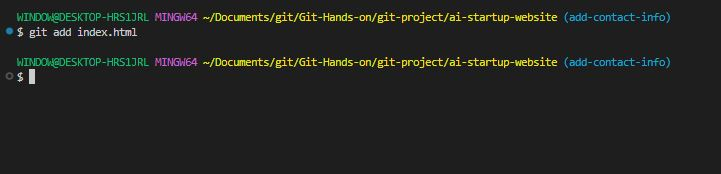

Commit Jerry changes

'git commit -m "Add contact information"'

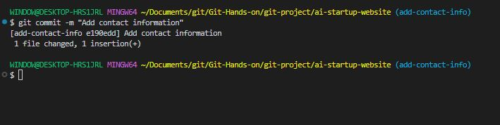

- Push Tom's branch to GitHub.

'git push origin add-contact-info'

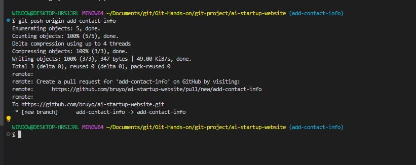 
