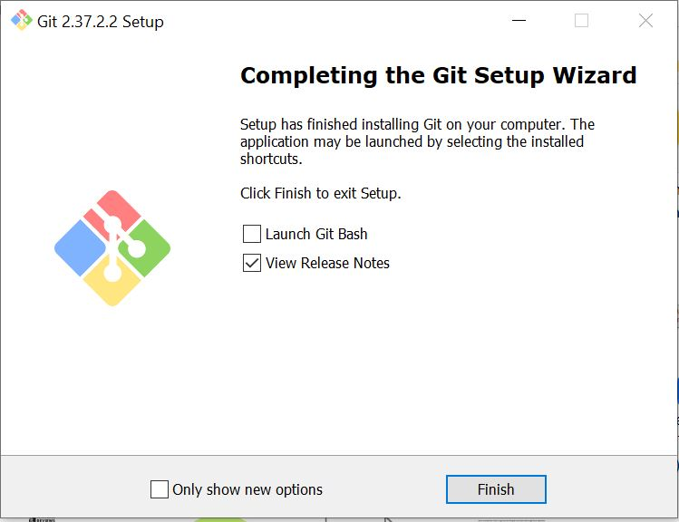

# Hands-On Git Project: Collaborative Website Development with Git and GitHub

In this mini-project, we'll create a step-by-step project to stimulate the workflow of Tom and Jerry using Git and GitHub. This hands-on project will include 
installation of Git, setting up a GitHub repository, cloning the repository, creating branches, making changes, and merging those changes back into the main branch.

## Part 1: Setup and Initial Configuration

### Install Git:

- Visit the official Git Website (https://git-scm.com/downloads) and download the latest version of Git suitable for your operating system.

- Follow the instructions to install git.

### Create a GitHub Repository:

- Sign up or login to GitHub.

- Click the "+" icon in the top-right corner and select "New Repository"

- Name your repository "ai-startup-website" and initialize it with a README file.

- Click "Create Repository" 

### Clone the Repository

- On your repository's page on GitHub, click the "Code" button and copy the HTTPS URL.

- Open your terminal or command prompt.

