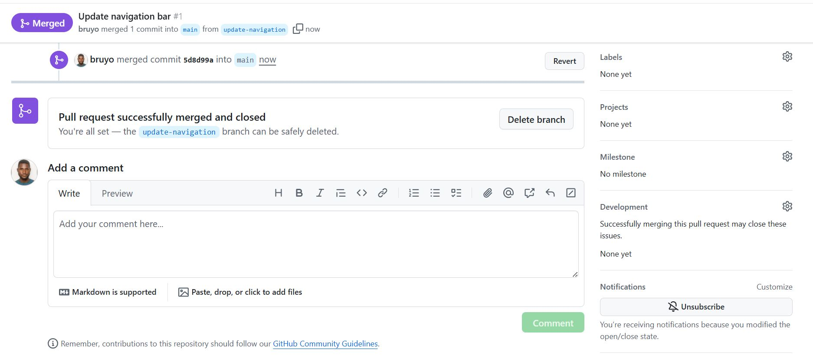

# Hands-On Git Project: Collaborative Website Development with Git and GitHub

In this mini-project, we'll create a step-by-step project to stimulate the workflow of Tom and Jerry using Git and GitHub. This hands-on project will include 
installation of Git, setting up a GitHub repository, cloning the repository, creating branches, making changes, and merging those changes back into the main branch.

## Part 1: Setup and Initial Configuration

### Install Git:

- Visit the official Git Website (https://git-scm.com/downloads) and download the latest version of Git suitable for your operating system.

- Follow the instructions to install git.

### Create a GitHub Repository:

- Sign up or login to GitHub.

- Click the "+" icon in the top-right corner and select "New Repository"

- Name your repository "ai-startup-website" and initialize it with a README file.

- Click "Create Repository" 

### Clone the Repository

- On your repository's page on GitHub, click the "Code" button and copy the HTTPS URL.

- Open your terminal or command prompt.

- Create a folder named "git-project"

'mkdir git-project

- Change directory into "git-project".

'cd git-project'

- Clone (Download) the repository from GitHub using

'git clone https://github.com/bruyo/ai-startup-website.git'

- Since you have just clonned your repository, your branch is "main"

- Navigate into the repository you clonned.

'cd ai-startup-website'

- Create an empty file "index.html"

'touch index.html'

- Add the content below 

" This is the Admin creating an index.html file for Tom and Jerry."

'vim index.html'

- Check changes has not been staged.

'git status'

- Stage changes.

'git add index.html'

- Confirm changes have been staged for commit.

'git status'

- Commit changes

'git commit -m "This is my first commit"'

- Push main branch to GitHub

'git push origin main'

## Part 2: Simmulating Tom and Jerry's Work

To simulate both Tom and Jerry working on the same laptop, you'll switch between two branches, making changes as each character.

### Tom Work:

- Navigate to the project dirctory you just cloned:

'cd ai-startup-website'

- Check the current branch.

'git branch'

- Create a new branch for Tom's work.

'git checkout -b update-navigation'

- Check the branch again to see your newly created branch.

'git branch'

- Recall you created an empty file "index.html" in the main branch. The file also exist in the "*update-navigation-branch*": Open the 'index.html' and add the content below.

'vim index.html'

'This is Tom adding Navigation to the AI-website'

- Check changes has not been staged.

'git status'

At this stage, Tom has modified the file, but these changes haven't been prepared for a commit in Git. This is indicated by the file name appearing in *red* in the terminal output, signaling that the changes 
are not recognized by Git but not yet staged.

- Stage Tom changes.

'git add index.html'

- Confirm changes have been staged for commit.

'git status'

Now, after staging the changes, the file name will appear in *green* in the terminal output. This color signifies that the file has been successfully staged, making it
ready for the next step, which is committing these changes to the project history.

- Commit Tom changes

'git commit -m "Update navigation bar"'

- Push Tom's branch to GitHub.

'git push origin update-navigation'

After completing Tom's workflow, you will now simulate Jerry's contribution tho the project. To do this, you'll take the following steps;

- Switch back to main branch 

'git switch main'

'git checkout main'

- Pull the latest changes.

'git pull origin update-navigation'

- Create a new branch for Jerry' Work.

'git checkout -b add-contact-info'

- Open *index.html* and Add Contact Information: Make your changes to the *index.html* file by adding contact information. 

'vim index.html'

- Stage Jerry changes.

'git add index.html'

Commit Jerry changes

'git commit -m "Add contact information"'

- Push Tom's branch to GitHub.

'git push origin add-contact-info'

 

## Part 3: Merging Changes

After both Tom and Jerry have pushed their changes, you (or another team member) can review and merge

these change into the main project.  The process involves;

1. Creating a *Pull Request*

2. Merging the Pull Request into the *main* branch.

### Understanding Pull Requests:

A Pull Request (PR) is a feature used in GitHub (and other Git-based version control systems) that allows you to notify team members

about the changes you've pushed to a branch in a repository. Essentially, it's a request to review and pull in your contribution to the

main project. Pull requests are central to the collaborative development process, enabling team members to discuss, review, and make further

changes before changes are merged.

### How to Create a Pull Request on GitHub

After both Tom and Jerry have pushed their work to their respective branches, the next step is to create a pull request for each of them.

Here's how Tom would create a pull request for his changes.

### Navigate to Your GitHub Repository:

- Open your web browser and go to the GitHub page for the repository.

 

### Switch to the Branch:

- Click on the branch dropdown menu near the top left corner of the file list and select the branch Tom have been working on, in this case,

*update-navigation* branch.

### Create a New Pull Request:

- Click the "New Pull Request" button next to the branch dropdown menu.

- GitHub will take you to a new page to initiate a pull request. Ite automatically selects the *main* project's branch as the base

and your recently pushed branch as the compare branch.

### Review Tom's Changes:

- Before creating the pull request, Tom would review his changes to ensure everything is correct. GitHub shows the differences between 

the base branch and Tom's branch. It's a good opportunity for Tom to double-check his work.

### Create the Pull Request:

- If everything looks good, click the "*Create pull request*" button. 

- Provide a title and description for the pull request. The title should be concise and descriptive, and the description should explain the 

change that the pull request is about, why it's needed, and any other relevant details.

- After filling in the information, click "*Create pull request*" again to officially open the pull request.

### Reviewing and Merging Tom's Pull Request:

Once the pull request is created, it becomes visible to other team members who can review the changes, leave comments, and request additional

modifications if necessary (This is an example of what collaboration is about in DevOps). When the team agrees that the changes are ready and

good to go, someone with the merge permissions can merge the pull request, incorporating the changes for Tom's *update-navigation* branch into the main branch.

Following the same process, Jerry would create a pull request for his *add-contact-info* branch after Tom's changes have been merged, ensuring

that the project stays up to date and conflicts are minimized.

### Updating Jerry's branch with latest changes:

Before Jerry merges his changes into the main branch, it's essential to ensure his branch is up-to-date with the main branch. This is because

other changes (like Tom's updates) might have been merged into the main branches after Jerry started working on his feature. Updating ensures

compatibility and reduces the chances of conflicts.

### Steps to Update Jerry's Branch:

- On terminal, switch to Jerry's Branch.

'git checkout add-contact-info'

- Pull the latest from the main branch:

'git pull origin main'

Purpose: This command fetches the changes from *main* branch (Remember, main branch now has Tom chnages) and merges them into Jerry's *add-contact-info* 

branch. It ensures that any updates made to the main branch, like Tom's merged changes, are now included in Jerry's branch. This step is crucial for avoiding

conflicts and ensuring that Jerry's work can smoothly integrate with the main project.

- Merge the pull request to the mmain branch: Click "*Merge Pull Request*" button to merge Tom's changes into the main branch. This action combines Tom's 

contributions with the rest of the project, completing the collaborative workflow.

### Fanilazing Jerry's Contribution:

Assuming there are no conflicts, Jerry's branch is now ready to be merged back into the main project.

- Push the Updated Branch to GitHub:

'git push origin add-contact-info'

This commands uploads Jerry's cahnges to GitHub. Now, his branch reflects both his work and the latest updates from the main branch.

The *origin* keyword in the command refers to the default name Git gives to the remote repository from which you cloned your project.

It's like a shortcut or an alias for the full URL of the repository in GitHub.

### Create the Pull Request:

- Click the "New Pull Request" button next to the branch dropdown menu.

- If everything looks good, click the "*Create pull request*" button. 

### Review Jerry's Changes:

- Before creating the pull request, Jerry would review his changes to ensure everything is correct. GitHub shows the differences between 

the base branch and Jerry's branch. It's a good opportunity for Jerry to double-check his work.

- Provide a title and description for the pull request. The title should be concise and descriptive, and the description should explain the 

change that the pull request is about, why it's needed, and any other relevant details.

- After filling in the information, click "*Create pull request*" again to officially open the pull request.

- GitHub will take you to a new page to initiate a pull request. It automatically selects the *main* project's branch as the base

and your recently pushed branch as the compare branch.

### Reviewing and Merging Jerry's Pull Request:

- Once the pull request is created, it becomes visible to other team members who can review the changes, leave comments, and request additional

When the team agrees that the changes are ready and good to go, someone with the merge permissions can merge the pull request, incorporating the changes for Jerry's *add-contact-info* branch into the main branch.

- Merge the pull request to the mmain branch: Click "*Merge Pull Request*" button to merge Jerry's changes into the main branch. This action combines Jerry's contributions with the rest of the project, completing the collaborative workflow.

This simulated workflow illustrates how Git facilitates collaborative development, allowing multiple developers to work simultaneously on different aspects of a project and merge their contributons seamlessly, even when working on the same files. 

<<<<<<< HEAD

=======
>>>>>>> cb8cf4e56b48765d02c4ead0cc435cd1dc6b042f
